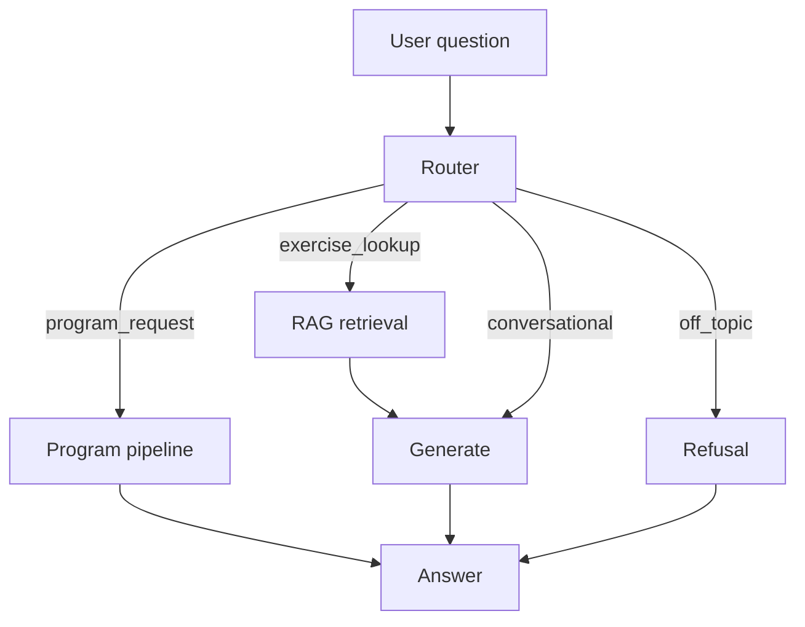

# Fitness Coach Cloud — AI Workout Assistant

An AI agent that answers exercise questions and generates personalized workout programs, combining RAG, LangGraph orchestration, and structured generation — deployed on Google Cloud Run.

This project is a cloud-deployed variant of [Fitness Coach](https://github.com/jpontoire/fitness_coach), rebuilt to run entirely on CPU and deploy for free: local fine-tuned inference (GPU) is replaced with hosted LLM inference (Groq or OpenAI, user-provided API key), removing the need for a GPU host.

## Features

- **Exercise lookup (RAG)** — semantic search over a dataset of 1,324 exercises (ChromaDB), reformatted into a consistent structure
- **Workout program generation** — extracts target muscles / equipment / constraints from a free-text request, retrieves relevant candidates per muscle group, and generates a structured, schema-validated program (Pydantic + retry logic)
- **Equipment filtering** — optional UI checkboxes filter retrieval by available equipment via Chroma metadata filtering, instead of relying solely on LLM extraction
- **Conversational Q&A** — general fitness/nutrition questions get natural language answers, not the structured exercise format
- **Off-topic refusal** — the agent stays on-topic and declines unrelated questions
- **Intent routing** — an LLM-based router (LangGraph) classifies each question into one of the four behaviors above
- **Provider-agnostic LLM client** — users supply their own Groq or OpenAI API key (no server-side key), so the deployment doesn't consume the author's quota

## Architecture



The program generation pipeline extracts structured parameters (muscles, equipment, preferences) from the request, retrieves exercise candidates per muscle group from ChromaDB, and generates a Pydantic-validated JSON program via the user's chosen LLM provider.

### Services (Google Cloud Run)

| Service    | Role                                              |
|------------|----------------------------------------------------|
| `api`      | FastAPI backend, LangGraph agent                    |
| `chroma`   | Vector store for exercise retrieval                 |
| `frontend` | Streamlit UI                                        |

## Tech Stack

**RAG**: ChromaDB, sentence-transformers, LangChain text splitters
**LLM inference**: Groq / OpenAI (OpenAI-compatible client, user-provided API key)
**Orchestration**: LangGraph, LangChain
**Structured generation**: Pydantic (schema validation + retry on malformed output)
**API & Frontend**: FastAPI, Streamlit
**Infra**: Google Cloud Run, Artifact Registry, Secret Manager

## Getting Started

### Prerequisites

- Docker + Docker Compose (for local run)
- A Groq or OpenAI API key

### Run locally

```bash
docker compose up
```

Once running:
- **UI**: http://localhost:8501
- **API docs (Swagger)**: http://localhost:8000/docs

Enter your API key in the sidebar to use the app.

### API example

```bash
curl -X POST http://localhost:8000/ask \
  -H "Content-Type: application/json" \
  -d '{"question": "Give me a push day workout", "equipment": ["dumbbell"], "provider": "groq", "api_key": "YOUR_KEY"}'
```

## Project Structure

```
fitness_coach_cloud/
├── data/                    # exercises.json (source dataset)
├── rag/                     # chunking, indexing (Chroma), retrieval
├── agent/                   # LangGraph state, router, nodes, program pipeline, llm client
├── api/                     # FastAPI app
├── frontend/                # Streamlit UI
├── Dockerfile                # API image
├── frontend/Dockerfile      # Frontend image
└── docker-compose.yml
```

## Dataset

Exercise data from [exercises-dataset](https://github.com/hasaneyldrm/exercises-dataset) (MIT licensed), used for text/metadata only.
