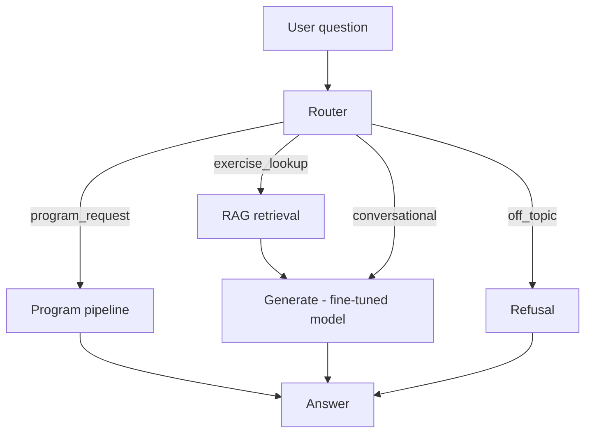

# Fitness Coach — AI Workout Assistant

An AI agent that answers exercise questions and generates personalized workout programs, combining RAG, a fine-tuned LLM, and LangGraph orchestration — fully containerized with Docker Compose.

This project was built as a hands-on deep dive into the full modern LLM application stack: retrieval-augmented generation, parameter-efficient fine-tuning (LoRA/QLoRA), agentic orchestration, structured/validated generation, and containerized deployment.

## Features

- **Exercise lookup (RAG)** — semantic search over a dataset of 1,324 exercises (ChromaDB), reformatted into a consistent structure by a fine-tuned model
- **Workout program generation** — extracts target muscles / equipment / constraints from a free-text request, retrieves relevant candidates per muscle group, and generates a structured, schema-validated program (Pydantic + retry logic)
- **Equipment filtering** — optional UI checkboxes filter retrieval by available equipment via Chroma metadata filtering, instead of relying solely on LLM extraction
- **Conversational Q&A** — general fitness/nutrition questions get natural language answers, not the structured exercise format
- **Off-topic refusal** — the agent stays on-topic and declines unrelated questions
- **Intent routing** — an LLM-based router (LangGraph) classifies each question into one of the four behaviors above

## Architecture



The program generation pipeline extracts structured parameters (muscles, equipment, preferences) from the request, retrieves exercise candidates per muscle group from ChromaDB, and generates a Pydantic-validated JSON program via Ollama.

### Services (Docker Compose)

| Service    | Role                                              | GPU |
|------------|----------------------------------------------------|-----|
| `api`      | FastAPI backend, LangGraph agent, fine-tuned model  | ✅  |
| `ollama`   | Base LLM (llama3.1:8b) for routing & program generation | ✅  |
| `chroma`   | Vector store for exercise retrieval                 | —   |
| `frontend` | Streamlit UI                                        | —   |

## Tech Stack

**RAG**: ChromaDB, sentence-transformers, LangChain text splitters
**Fine-tuning**: PyTorch, Hugging Face Transformers, PEFT (LoRA/QLoRA), TRL, bitsandbytes — Qwen2.5-3B-Instruct
**Orchestration**: LangGraph, LangChain, Ollama
**Structured generation**: Pydantic (schema validation + retry on malformed output)
**API & Frontend**: FastAPI, Streamlit
**Infra**: Docker Compose, NVIDIA Container Toolkit

## Getting Started

### Prerequisites

- Docker + Docker Compose
- NVIDIA GPU with drivers installed
- [NVIDIA Container Toolkit](https://docs.nvidia.com/datacenter/cloud-native/container-toolkit/latest/install-guide.html) configured for Docker

### Run

```bash
docker compose up
```

On first launch:
- The `ollama` service downloads `llama3.1:8b` automatically (~5GB, one-time, persisted in a volume)
- The `api` service downloads the base model (`Qwen2.5-3B-Instruct`) from Hugging Face and loads the fine-tuned LoRA adapter (included in this repo)
- The `frontend` waits for the API's `/health` check before starting

Once healthy:
- **UI**: http://localhost:8501
- **API docs (Swagger)**: http://localhost:8000/docs

### API example

```bash
curl -X POST http://localhost:8000/ask \
  -H "Content-Type: application/json" \
  -d '{"question": "Give me a push day workout", "equipment": ["dumbbell"]}'
```

## Fine-tuning

The LoRA adapter (`finetuning/fitness-lora-final/`) was trained on Qwen2.5-3B-Instruct with three mixed categories to avoid catastrophic forgetting:

1. **Structured** — reformat exercise data (from RAG context) into a consistent format
2. **Conversational** — natural language answers to general fitness questions
3. **Refusal** — polite decline for off-topic questions

Mixing these categories was a deliberate fix: an earlier version trained only on the structured format lost its ability to answer general or off-topic questions correctly (it would try to force the exercise format onto unrelated prompts like "what's the capital of Italy?").

## Project Structure

```
fitness_coach/
├── data/                    # exercises.json (source dataset)
├── rag/                     # chunking, indexing (Chroma), retrieval
├── finetuning/              # dataset generation, LoRA training, evaluation
│   └── fitness-lora-final/  # trained adapter (committed for reproducibility)
├── agent/                   # LangGraph state, router, nodes, program pipeline
├── api/                     # FastAPI app
├── frontend/                # Streamlit UI
├── Dockerfile                # API image
├── frontend/Dockerfile      # Frontend image
└── docker-compose.yml
```

## Dataset

Exercise data from [exercises-dataset](https://github.com/hasaneyldrm/exercises-dataset) (MIT licensed), used for text/metadata only.
